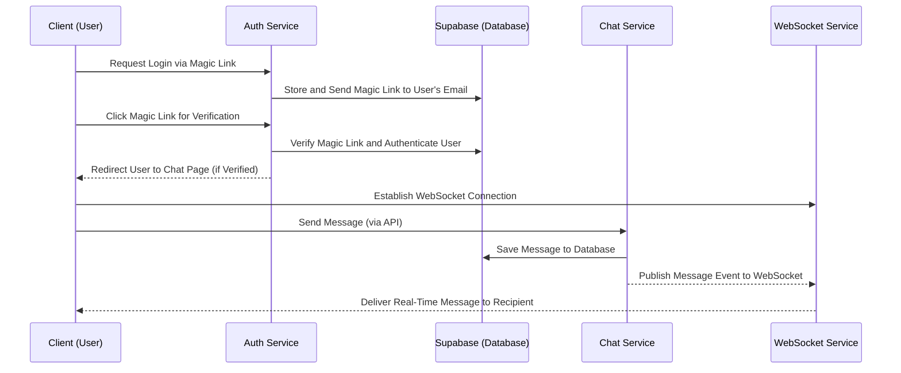

# Realtime Chat System
This project implements a real-time chat system using microservice architecture.
The system uses:
- Supabase for authentication and database storage.
- Next.js for the frontend interface.
- Express.js for backend services.
- Socket.IO for real-time WebSocket communication.

## Architecture Overview
> #### Auth Service
> - Manages user authentication using Supabase's Magic Link functionality.
> - Redirects users after successful authentication.
> 
> #### Chat Service
> - Stores and retrieves chat messages from the database.
> - Handles sending and fetching chat messages between users.
> 
> #### WebSocket Service
> - Maintains WebSocket connections using Socket.IO.
> - Sends real-time messages to connected users.
> 
> #### Database (Supabase)
> - Acts as the primary storage for user data, authentication, and chat messages.
>

## Architecture Diagram
```
┌────────────────────────────────────────────────────────┐
│                Auth Service (Port 5001)                │
│  - /auth/login                                         │
│  - Supabase Magic Link Authentication                  │
└───────────────┬────────────────────────────────────────┘
                │
                ▼
┌────────────────────────────────────────────────────────┐
│                Chat Service (Port 5002)                │
│  - /chat/send                                          │
│  - /chat/history                                       │
│  - Stores and retrieves messages from Supabase         │
└───────────────┬────────────────────────────────────────┘
                │
                ▼
┌────────────────────────────────────────────────────────┐
│               WebSocket Service (Port 5003)            │
│  - Real-time communication using Socket.IO             │
│  - Broadcasts messages to clients                      │
└────────────────────────────────────────────────────────┘
                │
                ▼
┌────────────────────────────────────────────────────────┐
│               Next.js Frontend                         │
│  - Login and Chat Pages                                │
│  - Connects to WebSocket Service                       │
└────────────────────────────────────────────────────────┘
```
## Specification of Microservices

| Micro-service    | Responsibilities                                                                                                            | Key Feature                                        | Database Entities                                           | API Endpoints                                                                                   |
|------------------|-----------------------------------------------------------------------------------------------------------------------------|-----------------------------------------------------|------------------------------------------------------------|-------------------------------------------------------------------------------------------------|
| **Auth Service** |Manages user authentication via Supabase Magic Link. Redirects users to the chat page after sucessful login. | **Magic Link Authentication:** Simplifies login flow | **Users:** Contains user email and session data | `POST /auth/login`: Sends a magic link to the user<br>|
| **Chat Service** | Handles message creation and retrieval between users. Stores chat history in Supabase.| **Persistent Message Storage:** Stores messages. | **Messages:** Stores sender, recipient, and content | `POST /chat/send`: Sends a new message <br>`GET /chat/history`: Fetches chat history |
| **WebSocket Service** |Establishes WebSocket connections. Handles real-time message delivery to online users. | **Real-Time Delivery:** Instant messaging.|None (no direct DB usage).| WebSocket endpoint: `ws://<host>:5003` |
| **Database (Supabase)** |Provides persistent storage for users and messages, with built-in authentication. | **Integrated Authentication**: Supabase handles user auth and storage. | **Users** and **Messages** tables.| Managed via Supabase dashboard. |

## Workflow Diagram

