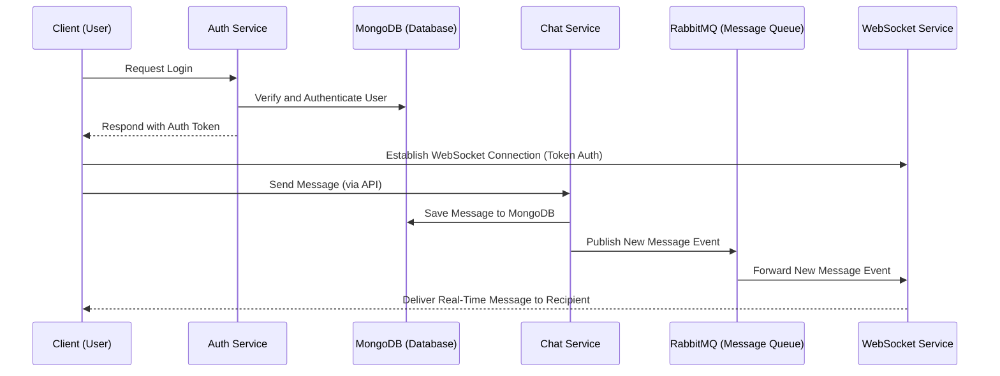
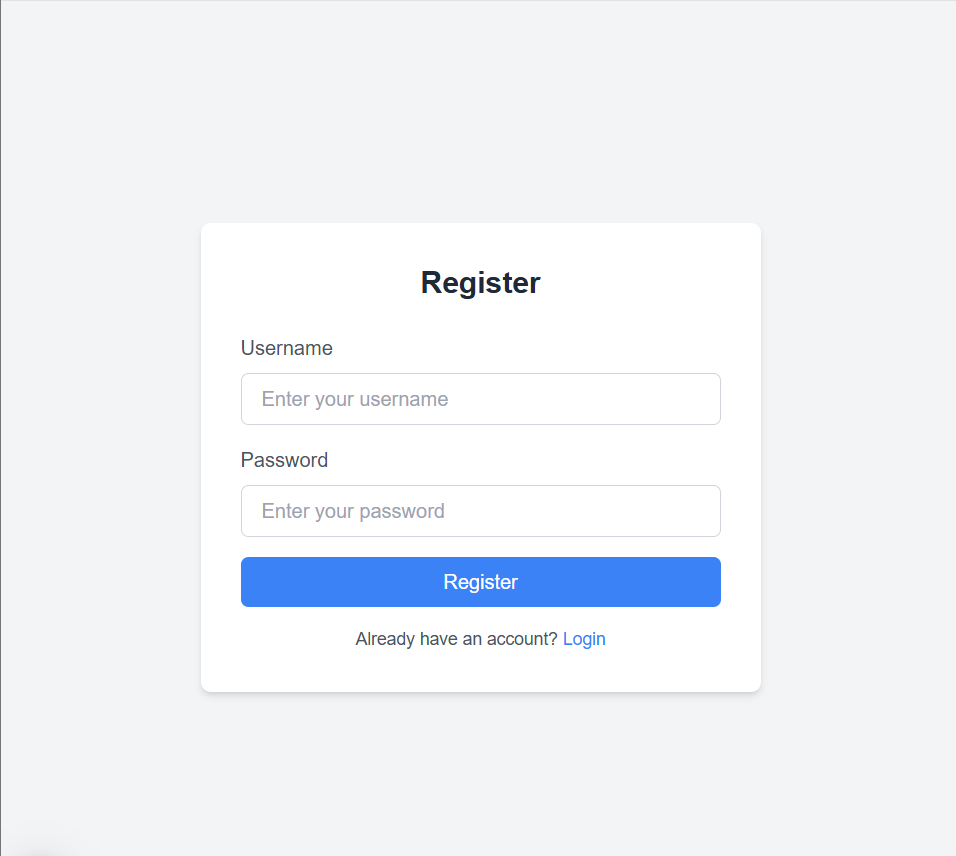
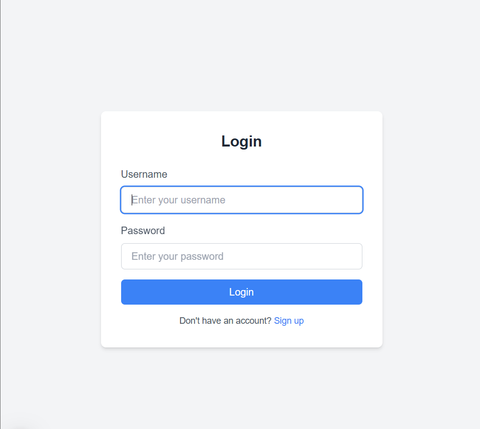
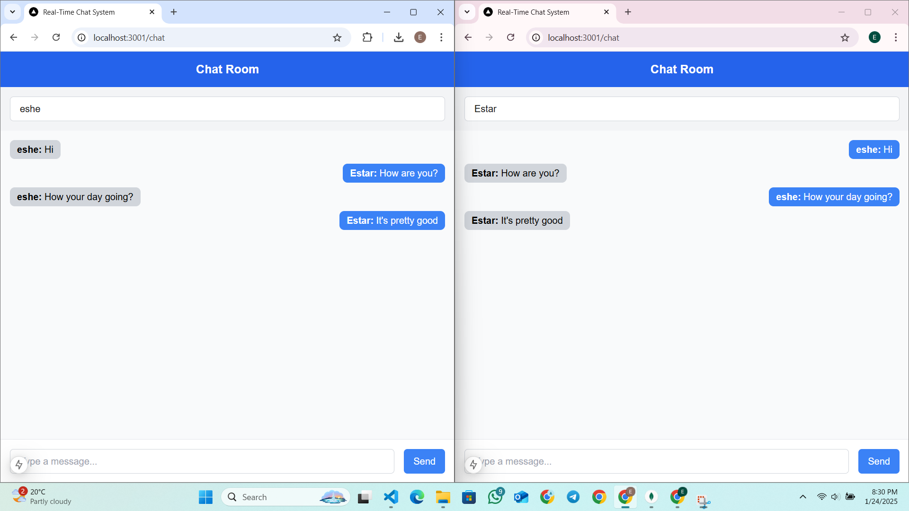

# Realtime Chat System
This project implements a real-time chat system using a microservices architecture. The system is designed for scalability, leveraging MongoDB for database storage, RabbitMQ for message queuing, and WebSocket for real-time communication.
## Key Technologies
- MongoDB: Primary database for user data and chat messages.
- RabbitMQ: Message broker for asynchronous communication between services.
- Socket.IO: Real-time WebSocket communication.
- Next.js: Frontend interface for users.
- Express.js: Backend services for authentication, chat, and WebSocket handling.

## Features

 ### Login and Authentication
  - Secure user authentication with MongoDB.
  - Localstorage JWT token-based authentication
 ### Real-Time Chat
  - Messages are instantly delivered using WebSockets.
  - Chat history stored in MongoDB.
 ### Message Queue
  - RabbitMQ ensures efficent communication between services.

## Architecture Overview
> #### Auth Service
> - Manages user authentication.
> - MongoDB stores user data.
> - Redirects users after successful authentication.
> 
> #### Chat Service
> - Handles sending and retrieving chat messages.
> - Stores chat history in MongoDB.
> - Publishes new message events to RabbitMQ.
>
> #### WebSocket Service
> - Subscribes to RabbitMQ for real-time updates.
> - Sends real-time messages to connected users using WebSocket.
> 
> #### Database (MongoDB)
> - Stores user data and chat messages.
>


## Architecture Diagram
```
┌────────────────────────────────────────────────────────┐
│                Auth Service (Port 5001)                │
│  - /auth/login                                         │
│  - MongoDB user authentication                         │
└───────────────┬────────────────────────────────────────┘
                │
                ▼
┌────────────────────────────────────────────────────────┐
│                Chat Service (Port 5002)                │
│  - /chat/send                                          │
│  - /chat/history                                       │
│  - Stores and retrieves messages from Supabase         |
|  - Publishes events to RabbitMQ                        │
└───────────────┬────────────────────────────────────────┘
                │
                ▼
┌────────────────────────────────────────────────────────┐
│               WebSocket Service (Port 5003)            │
│  - Subscribes to RabbitMQ                              │
│  - Real-time communication using Socket.IO             │
│  - Sends messages to connected clients                 │
└────────────────────────────────────────────────────────┘
                │
                ▼
┌────────────────────────────────────────────────────────┐
│               Next.js Frontend                         │
│  - Login and Chat Pages                                │
│  - Connects to WebSocket Service                       │
└────────────────────────────────────────────────────────┘
```
## Specification of Microservices

| Micro-service    | Responsibilities                                                                                                            | Key Feature                                        | Database Entities                                           | API Endpoints                                                                                   |
|------------------|-----------------------------------------------------------------------------------------------------------------------------|-----------------------------------------------------|------------------------------------------------------------|-------------------------------------------------------------------------------------------------|
| **Auth Service** |Manages user authentication using MongoDB. Redirects users to the chat page after sucessful login. | **Authentication Management:** Simplifies login flow | **Users:** Stores user email and hased passwords | `POST /auth/register`: Register a user `POST /auth/login`: Login a user<br>|
| **Chat Service** | Handles message creation and retrieval between users. Publishes message events to RabbitMQ.| **Persistent Message Storage:** Stores messages. | **Messages:** Stores sender, recipient, and content | `POST /chat/send`: Sends a new message <br>`GET /chat/history`: Fetches chat history |
| **WebSocket Service** |Listens to RabbitMQ for events and sends real-time messages to users via WebSocket. | **Real-Time Delivery:** Instant messaging.|None (no direct DB usage).| WebSocket endpoint: `ws://<host>:5003` |
| **Database (MongoDB)** |Provides persistent storage for users and messages. | **Scalable Storage** | **Users** and **Messages** tables.| Managed via MongoDB. |

## Workflow Diagram

## Prerequisites
1. **MongoDB Instance**
  - Set up a local or cloud MongoDB instance (e.g., MongoDB Atlas).
2. **Node.js and npm**
  - Install the latest version of Node.js and npm.
3. **RabbitMQ Instance**
  - Install RabbitMQ locally or use a hosted RabbitMQ service.
3. **Postman**
  - Use for testing API endpoints and Websocket connections.

## Setup and Installation
1. **Clone the Repository**
   ```bash
   https://github.com/Eshetu21/DS-CHAT.git
   cd chat-app
   ```
2. **Install Dependencies**
   Each service has its own dependencies. Navigate to each folder and install them:
   ```bash
   cd auth-service
   npm install
   ```
   ```bash
   cd ../chat-service
   npm install
   ```
   ```bash
   cd ../websocket-service
   npm install
   ```
   ```bash
   cd ../client
   npm install
   ```
3. **Environmental Variables**
   Create a .env file for each service:
     - Auth Service
     ```bash
     MONGO_URI=mongodb://localhost:27017/auth-db
     JWT_SECRET=your_secret_key
     ```
    - Chat Service
     ```bash
     MONGO_URI=mongodb://localhost:27017/auth-db
     JWT_SECRET=your_secret_key
     ```
    - WebSocket Service
     ```bash
     MONGO_URI=mongodb://localhost:27017/auth-db
     JWT_SECRET=your_secret_key
     ```
    - Frontend
    ```bash
    NEXT_PUBLIC_API_URL=http://localhost:5001
    NEXT_PUBLIC_WS_URL=ws://localhost:5003
   ```
4. **Start RabbitMQ**
    ```bash
    rabbitmq-service start
    ```
4. **Run Each Service**
   Start each services on their respective ports by going to each folder and running:
   ```bash
     npm run dev
   ```
5. **Test the Application**
   - Access the login page at `http://localhost:3000/login`
   - Enter an email and click **Send Magic Link**
   - Click the magic link in your email to be redirected to the chat page.
   - Send messages to other users and see real-time updates.

## API Endpoints
### Auth Service
|**Endpoint**| **Description**|**Method**|**Example Request Body**|
|-----------|----------------|----------|------------------------|
`/auth/register`|Register new user|POST|`{"email":"user@example.com","password":"123456"}`|
`/auth/login`|Login a user|POST|`{"email":"user@example.com","password":"123456"}`|


### Chat Service
|**Endpoint**| **Description**|**Method**|**Example Request Body**|
|-----------|----------------|----------|------------------------|
`/chat/send`|Sends a message|POST|`{"recipient_id":"...","content":"Hello"}`|
`/chat/history`|Fetches chat history between users|GET|`?user1=user1-id&user2=user2-id`|

## Testing the Application
### Login
1. Access the login page at `http://localhost:3000/login`.
2. Register or login with valid credentials
### Real-Time Chat
1. Access the chat page at `http://localhost:3000/chat`.
2. Start sending messages and see real-time updates with other logged-in users.
3. Observe real-time updates via WebSocket.

### Screenshots
Here are some screenshots of the app: 
<p>
  
  
  
</p>


     
